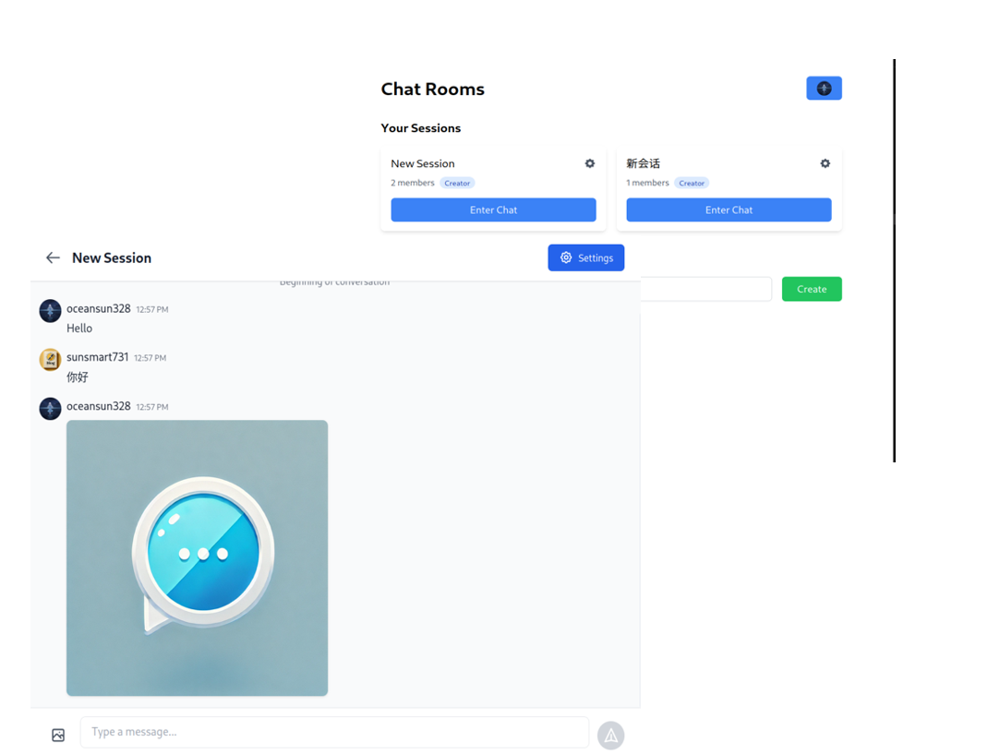

<p align="center">
  
</p>

# Chat Room 

<p align="center">
  
</p>

## Overview

The Chat Room Application is a full-stack real-time chat platform designed to support seamless communication between users. It combines a Go-based RESTful API backend with a modern React frontend built using Tailwind CSS. The application supports text and image messages, session management, and real-time messaging via WebSockets.

---

## Key Features

- **Real-Time Messaging:** Instant communication powered by WebSockets.
- **User Authentication:** Secure JWT-based authentication for registration and login.
- **Chat Sessions:** Create, join, and manage dedicated chat sessions.
- **Media Support:** Upload and display image messages using MinIO.
- **Robust API:** RESTful API endpoints for managing users, sessions, and messages.
- **Dockerized Deployment:** Easily run the backend and frontend using Docker or Podman.
- **Responsive UI:** Built with React and Tailwind CSS for modern, responsive design.

---

## Project Structure

- **Backend:**  
  - Language: Go  
  - Framework: [Chi](https://github.com/go-chi/chi)  
  - Data Storage: PostgreSQL  
  - File Storage: MinIO (for image uploads)  
  - Authentication: JWT tokens  
  - Key Directories: `backend/handlers`, `backend/middleware`, `backend/models`, `backend/store`

- **Frontend:**  
  - Language: JavaScript (React)  
  - Styling: Tailwind CSS  
  - Routing: React Router  
  - Key Directories: `frontend/src/pages`, `frontend/src/components`, `frontend/src/services`

- **Docker:**  
  - Two Dockerfiles exist for the backend and frontend respectively.  
  - A unified `docker-compose.yml` file is provided to orchestrate containers along with PostgreSQL and MinIO.

---

## Prerequisites

- **Go:** 1.21 or higher  
- **Node.js:** 18 or higher  
- **PostgreSQL:** 12 or higher  
- **Docker/Podman**

---

## Getting Started

### Using Docker Compose

1. **Clone the repository:**
   ```bash
   git clone https://your-repository-url.git
   cd your-repository
   ```

2. **Configure Environment Variables:**

   - For the backend, create a `.env` file (based on `backend/.env.example`) with your configuration:
     - `PORT`
     - `DB_HOST`
     - `DB_PORT`
     - `DB_USER`
     - `DB_PASSWORD`
     - `DB_NAME`
     - `JWT_SECRET`
     - `MINIO_ENDPOINT`
     - `MINIO_ACCESS_KEY`
     - `MINIO_SECRET_KEY`
     - `MINIO_BUCKET_NAME`

3. **Build and Run:**
   ```bash
   docker-compose up --build
   ```
   - The backend will be accessible at [http://localhost:8080](http://localhost:8080) and the frontend at [http://localhost:3000](http://localhost:3000).

---

### Running Locally Without Docker

#### Backend

1. **Navigate to the backend directory:**
   ```bash
   cd backend
   ```

2. **Install dependencies and build:**
   ```bash
   go mod download
   go build -o main .
   ./main
   ```

#### Frontend

1. **Navigate to the frontend directory:**
   ```bash
   cd frontend
   ```

2. **Install dependencies and start the development server:**
   ```bash
   yarn install
   yarn start
   ```
   - Open [http://localhost:3000](http://localhost:3000) in your browser.

---

## Environment Variables

### Backend

The backend requires the following environment variables:

- `PORT`: Port on which the backend server runs (e.g., 8080)
- `DB_HOST`: Database host address
- `DB_PORT`: Database port (e.g., 5432)
- `DB_USER`: Database username
- `DB_PASSWORD`: Database password
- `DB_NAME`: Name of the PostgreSQL database
- `JWT_SECRET`: Secret key for signing JWT tokens
- `MINIO_ENDPOINT`: MinIO server endpoint (e.g., `minio:9000`)
- `MINIO_ACCESS_KEY`: Access key for MinIO
- `MINIO_SECRET_KEY`: Secret key for MinIO
- `MINIO_BUCKET_NAME`: Name of the bucket for file uploads

### Frontend

The frontend configuration is managed via the file `frontend/src/config.js`, which defines:
- `API_BASE_URL`: Base URL for the backend API (e.g., `http://localhost:8080`)
- `WS_BASE_URL`: Base URL for WebSocket connections (e.g., `ws://localhost:8080`)

---

## API Endpoints

The backend exposes a variety of RESTful endpoints, including:

- **Authentication:**
  - `POST /api/auth/register` – Register a new user.
  - `POST /api/auth/login` – Login a user and return a JWT token.

- **Sessions:**
  - `GET /api/sessions` – List available chat sessions.
  - `POST /api/sessions` – Create a new chat session.
  - `GET /api/sessions/:sessionId/join` – Join a chat session.
  - `GET /api/sessions/:sessionId/manage` – Manage a chat session (creator actions).

- **Users:**
  - `GET /api/users/:id` – Retrieve user details.
  - `GET /api/users/sessions` – Get sessions associated with a user.
  - `PUT /api/users/:id/nickname` – Update a user's nickname.
  - `PUT /api/users/:id/username` – Update a user's username.

- **WebSocket:**
  - `GET /ws` – WebSocket endpoint for real-time messaging.

For complete details, refer to the [backend source code](backend/main.go) and relevant handler files.

---

## Testing

### Frontend
- Run tests with:
  ```bash
  yarn test
  ```

### Backend
- Use Go's built-in testing tools. For example:
  ```bash
  go test ./...
  ```

---

## Deployment

- **Using Docker:**  
  The provided Dockerfiles and `docker-compose.yml` allow for seamless containerized deployment. Update environment variables as needed for production.

- **Without Docker:**  
  Ensure your production environment is configured with secure environment variables, and build the frontend (`yarn build`) before serving the static assets.

---

## Contributing

Contributions are welcome! Please follow these steps:

1. Fork the repository.
2. Create a new branch for your feature or bug fix.
3. Submit a pull request with a detailed description of your changes.

---

## License

This project is licensed under the MIT License. See the [LICENSE](LICENSE) file for more details.

---

## Additional Resources

- **Frontend Documentation:** Refer to `frontend/README.md` for details on running and developing the React application.
- **Backend Documentation:** The backend's source code in `backend/main.go` and the associated handler, middleware, and store packages contain detailed information on all available endpoints and business logic.

Enjoy the Chat Room Application and happy coding!
